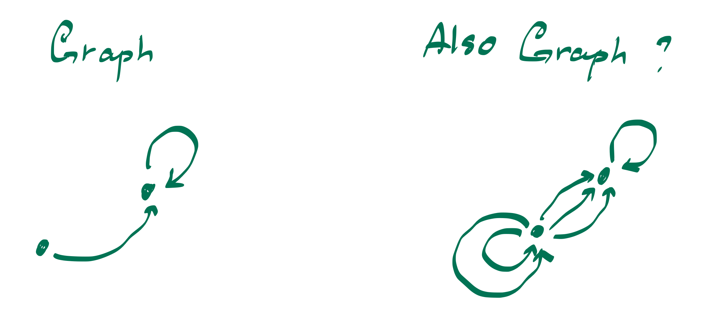
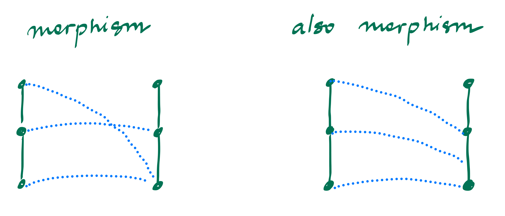

# A Study of Concrete Categorizations of Graphs
*guest post by [Maria Ramos]() and [Aya Samadzelkava]()

**Introduction**
1. why understanding and looking at the structure of graph types is useful? (A)   
3. what is this classification/stuctcure? fig 1,2 (M)
4. what are set axioms and why are they useful for comparison? table
   3.1.
   3.2.
   3.3.
   3.4.
   3.5.
   3.6.

# 1. 
Imagine looking at two drawings side by side: on the left, a small, loopless network with just a few edges; on the right, a more tangled structure—complete with multiple edges linking the same vertices and perhaps a loop or two. You might label both of these objects as “graphs,” yet they look and behave quite differently. The first picture highlights precisely this: while each example certainly qualifies as a “graph,” the rules governing what counts as an “edge” or a “loop” can vary widely from one definition to another. This ambiguity is why we talk about types of graphs.

Now consider a second picture, showing how one graph can map into another. On the left, you see a “strict” morphism that matches each vertex and edge precisely, preserving the structure down to the last detail. On the right, a more relaxed morphism allows edges to “collapse” or be identified in a simpler way—perhaps merging two edges into one if they serve the same role. Both are legitimate ways to interpret “graph morphisms,” yet they impose very different constraints on how graphs can transform.

At first glance, it may seem that studying nodes and edges directly is enough. But these pictures nudge us to shift our perspective. We start thinking less about the specific shapes of graphs and more about the *rules* that define them. For instance, is more than one edge between two vertices allowed? Can loops exist? Does a morphism have to map edges to edges, or can it send edges to vertices? Each choice leads to a different notion of “graph,” and correspondingly different morphisms.
